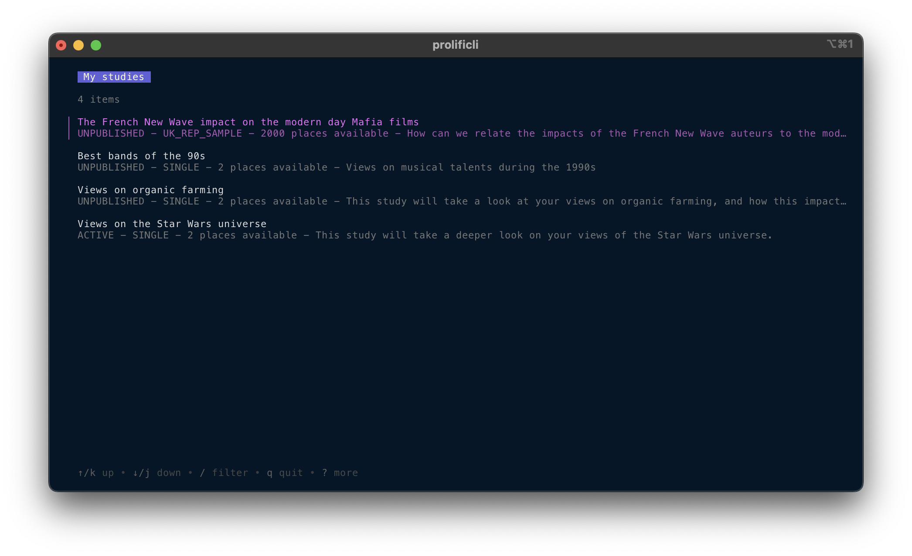
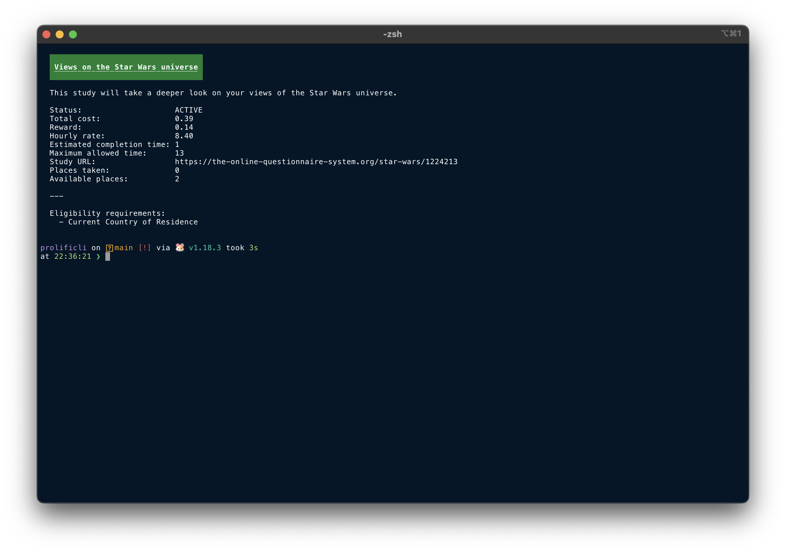

# Prolificli


[](https://goreportcard.com/report/github.com/benmatselby/prolificli)

CLI application for getting information out of [Prolific](https://www.prolific.co) about your research studies.

```text
CLI application for retrieving data from Prolific

Usage:
  prolificli [command]

Available Commands:
  completion   Generate the autocompletion script for the specified shell
  help         Help about any command
  hook         Manage and view your hook subscriptions
  projects     Provide details about your projects
  requirements List all eligibility requirements available for your study
  studies      Provide details about your studies
  study        Manage and view your studies
  submission   View your study submissions
  whoami       Provide details about your account
  workspaces   Provide details about your workspaces

Flags:
      --config string   config file (default is $HOME/.benmatselby/prolificli.yaml)
  -h, --help            help for prolificli
  -v, --version         version for prolificli

Use "prolificli [command] --help" for more information about a command.
```





Main features include:

- Ability to list and filter studies.
- Ability to list submissions for a given study.
- Ability to list studies and define which fields to do display in a table format.
- Ability to render details about a study, and the submissions.
- Ability to create a Study via a YAML/JSON configuration file.
- Ability to publish a study whilst creating it (if you have sufficient funds).
- Ability to silently create a study, meaning you [can script creating many studies in one go](https://github.com/benmatselby/prolificli/wiki/Create-multiple-studies-via-a-bash-script).
- Ability to get your user account details.
- Ability to list your hook subscriptions.

Checkout the [wiki](https://github.com/benmatselby/prolificli/wiki) for more tips and tricks.

## Requirements

If you are wanting to build and develop this, you will need the following items installed. If, however, you just want to run the application I recommend using a binary (See below).

- [Go version 1.19+](https://go.dev/doc/install)

## Configuration

You can create studies via a configuration file. See some examples in `/docs/examples`. It's one study per file.

You can then create a study by calling:

```shell
prolificli study create -t docs/examples/standard-sample.yaml
```

### Environment variables

You will need the following environment variables defining:

```shell
export PROLIFIC_TOKEN=""
```

You can create a Researcher token in your account. Log in, and go to settings.

You can optionally override the URL for the API too. This will be set as default to the Prolific API URL. You have want to override this if Prolific have granted you access to a different environment.

```shell
export PROLIFIC_URL="https://api.prolific.co"
```

## Installation

You can install this application a few ways:

<details>
<summary>Installation via Docker</summary>

Other than requiring [docker](http://docker.com) to be installed, there are no other requirements to run the application this way.

```shell
$ docker run \
  --rm \
  -t \
  -ePROLIFIC_URL \
  -ePROLIFIC_TOKEN \
  -v "${HOME}/.benmatselby":/root/.benmatselby \
  benmatselby/prolificli:latest "$@"
```

The `latest` tag mentioned above can be changed to a released version. For all releases, see [here](https://hub.docker.com/repository/docker/benmatselby/prolificli/tags).

| Tag      | What it means                                                                           |
| -------- | --------------------------------------------------------------------------------------- |
| `latest` | The latest released version                                                             |
| `main`   | The latest git commit, not released as a tag yet                                        |
| `v*`     | [Docker releases](https://hub.docker.com/repository/docker/benmatselby/prolificli/tags) |

You can also build the image locally:

```shell
make docker-build
```

</details>

<details>
<summary>Installation via Git</summary>

```shell
git clone git@github.com:benmatselby/prolificli.git
cd prolificli
make all
./prolificli
```

You can also install into your `$GOPATH/bin` by running `make build && go install`.

</details>

<details>
<summary>Installation via Binaries</summary>

You can download the binaries from the [release pages](https://github.com/benmatselby/prolificli/releases). Find the release you want, and check the "Assets" section.

Once downloaded, be sure to put the binary in a folder that is referenced in your `$PATH`.

</details>
