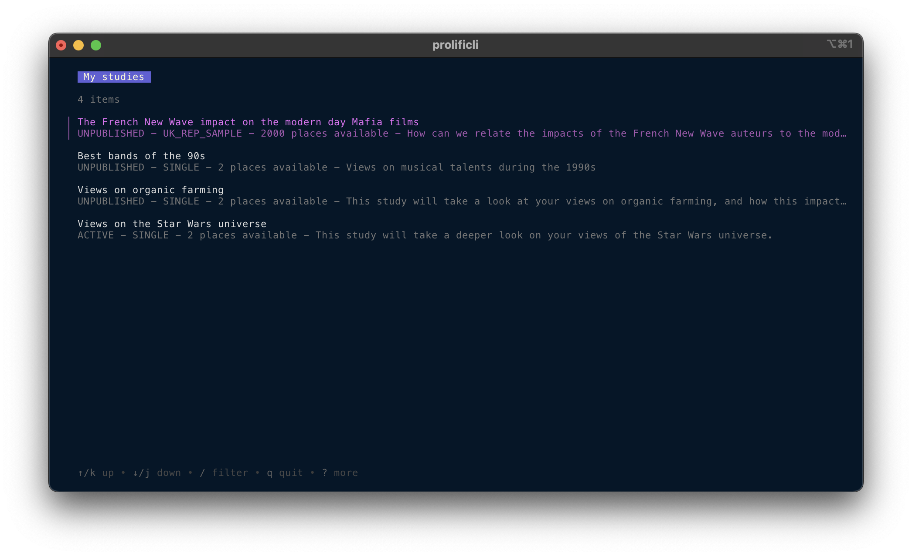
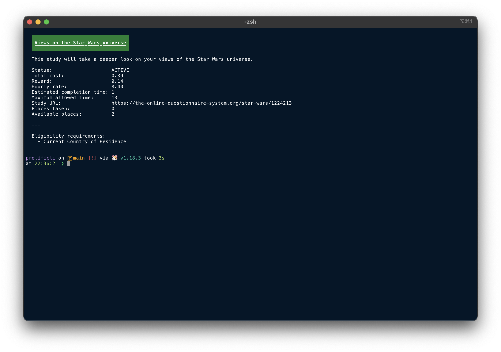

<div align="center">
  

  <h1>Prolific CLI</h1>

<i>A command-line interface for Prolific</i>

</div>

<hr />


CLI application for getting information out of [Prolific](https://www.prolific.com) about your research studies.

This CLI is an **experimental, open, proof of concept** project from engineers at Prolific. As such, there *may* be discrepancies with the Prolific API.

```text
CLI application for retrieving data from the Prolific Platform

Usage:
  prolific [command]

Available Commands:
  campaign     Provide details about your campaigns
  completion   Generate the autocompletion script for the specified shell
  credentials  Manage credential pools
  filter-sets  Manage and view your filter sets
  help         Help about any command
  hook         Manage and view your hook subscriptions
  message      Send and retrieve messages
  participant  Manage and view your participant groups
  project      Manage and view your projects in a workspace
  requirements List all eligibility requirements available for your study
  studies      List all of your studies
  study        Manage and view your studies
  submission   Manage and view your study submissions
  whoami       View details about your account
  workspace    Manage and view your workspaces

Flags:
      --config string   config file (default is $HOME/.config/prolific-oss/prolific.yaml)
  -h, --help            help for prolific
  -v, --version         version for prolific

Use "prolific [command] --help" for more information about a command.
```





Main features include:

- Ability to list and filter studies.
- Ability to list submissions for a given study.
- Ability to list studies and define which fields to do display in a table format.
- Ability to render details about a study, and the submissions.
- Ability to create and update credential pools for studies requiring authentication.
- Ability to download credentials usage report for a study as CSV.
- Ability to create a Study via a YAML/JSON configuration file.
- Ability to publish a study whilst creating it (if you have sufficient funds).
- Ability to silently create a study, meaning you [can script creating many studies in one go](https://github.com/prolific-oss/cli/wiki/Create-multiple-studies-via-a-bash-script).
- Ability to get your user account details.
- Ability to list your hook subscriptions.
- Ability to send and retrieve messages.
- Ability to list and view your filter sets
- Ability to list and view your participant groups

Checkout the [wiki](https://github.com/prolific-oss/cli/wiki) for more tips and tricks.

## Requirements

If you are wanting to build and develop this, you will need the following items installed. If, however, you just want to run the application I recommend using a binary (See below).

- [Go version 1.26+](https://go.dev/doc/install)

## Configuration

You can create studies via a configuration file. See some examples in `/docs/examples`. It's one study per file.

You can then create a study by calling:

```shell
prolific study create -t docs/examples/standard-sample.yaml
```

You can also define some defaults in the configuration file: `$HOME/.config/prolific-oss/prolific.yaml`.

Currently you can define the following:

```yaml
workspace: xxxxxxxxxx
```

### Environment variables

You will need the following environment variables defining:

```shell
export PROLIFIC_TOKEN=""
```

You can create a Researcher token in your [account](https://app.prolific.com/researcher/tokens/).

You can optionally override the URL for the API too. This will be set as default to the Prolific API URL. You can override this if Prolific have granted you access to a different environment.

```shell
export PROLIFIC_URL="https://api.prolific.com"
```

## Installation

You can install this application a few ways:

<details>
<summary>Installation via Git</summary>

```shell
git clone https://github.com/prolific-oss/cli.git
cd cli
make all
./prolific
```

You can also install into your `$GOPATH/bin` by running `make build && go install`.

</details>

<details>
<summary>Installation via Binaries</summary>

You can download the binaries from the [release pages](https://github.com/prolific-oss/cli/releases). Find the release you want, and check the "Assets" section.

Once downloaded, be sure to put the binary in a folder that is referenced in your `$PATH`.

</details>

<details>
<summary>Installation via Go Install</summary>

```shell
go install github.com/prolific-oss/cli/cmd/prolific@latest
```

</details>

## Development with Claude Code

When implementing new CLI commands, use the `/cli-command-create` skill.

### Option 1: Natural Language

Simply describe what command you want to create:

```
Create a new command to publish collections
```

```
Add a command that lets users delete studies
```

Claude will ask follow-up questions to gather the ticket number, API contract, and other details.

### Option 2: Slash Command with Arguments

Use the slash command with optional arguments:

```
/cli-command-create
```

Or provide arguments directly (ticket, resource, command, command-type):

```
/cli-command-create DCP-2190 collection publish CREATE
```

```
/cli-command-create DCP-2200 study delete ACTION
```

**Argument order:** `[ticket] [resource] [command] [command-type]`

| Argument | Description | Examples |
|----------|-------------|----------|
| `ticket` | Jira ticket number | DCP-2190 |
| `resource` | Resource name | collection, study, workspace |
| `command` | Command name | list, get, create, publish |
| `command-type` | Command type (optional) | LIST, VIEW, CREATE, UPDATE, ACTION |

If any arguments are omitted, Claude will ask for them interactively.

### What the Skill Does

1. Gathers requirements (API contract, flags, command type)
2. Presents an implementation plan for approval
3. Implements model, client, command, UI renderers, mocks, and tests
4. Verifies with `make test` and `make lint`

## Contributing

We welcome contributions! Please see our [Contributing Guide](CONTRIBUTING.md) for details on how to get started.

## Release Process

Releases are managed via GitHub Releases with changelog generation powered by [git-cliff](https://git-cliff.org/).

### 1. Generate changelog

```bash
make changelog VERSION=0.0.60
```

This generates grouped release notes from conventional commits, merges any hand-written notes from the `## next` section of `CHANGELOG.md`, and updates the changelog file.

### 2. Create a release PR

Create a PR with the updated `CHANGELOG.md` and apply the `release` label.

One CI gate will validate the PR:

- **Changelog gate** — confirms `CHANGELOG.md` is modified when the `release` label is present.

### 3. Merge to trigger the release

Once the PR is approved and merged to `main`, CI automatically:

1. Extracts the version from the latest `## x.y.z` section in `CHANGELOG.md`
2. Creates and pushes a `vx.y.z` git tag
3. Creates a GitHub Release titled `vx.y.z` (always use the `v` prefix for tags and release names, e.g. `v1.0.1`, not `1.0.1`) with the changelog entry as release notes
4. Builds binaries for multiple platforms (darwin, linux, windows, freebsd) and uploads them to the release

Users can then download binaries from the release page or use `go install`.
