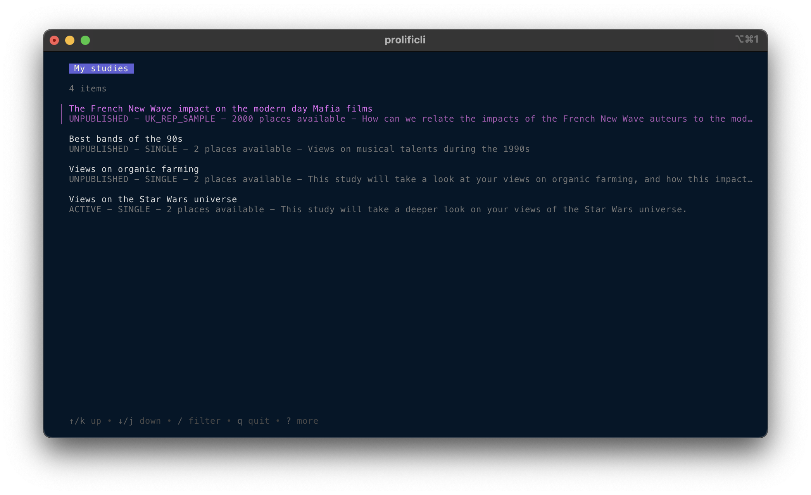
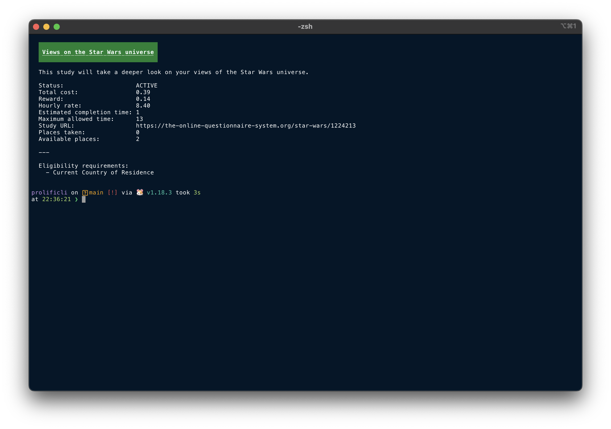

<div align="center">
  

  <h1>Prolific CLI</h1>

<i>A command-line interface for Prolific</i>

</div>

<hr />


The CLI for all [Prolific](https://www.prolific.com) interactions — built for humans and AI agents.

> `brew install prolific-oss/tap/prolific` see [Installation](#installation) for other options.

```text
CLI application for retrieving data from the Prolific Platform

Usage:
  prolific [command]

Available Commands:
  aitaskbuilder AI Task Builder tools and utilities
  bonus         Create and pay bonuses for study participants
  campaign      Provide details about your campaigns
  collection    Manage and view your collections
  completion    Generate the autocompletion script for the specified shell
  credentials   Manage credential pools
  feedback      View participant feedback for your studies
  filter-sets   Manage and view your filter sets
  filters       List all filters available for your study
  help          Help about any command
  hook          Manage and view your hook subscriptions
  invitation    Manage workspace invitations
  message       Send and retrieve messages
  participant   Manage and view your participant groups
  project       Manage and view your projects in a workspace
  researcher    Manage researcher resources
  studies       List all of your studies
  study         Manage and view your studies
  submission    Manage and view your study submissions
  template      Browse and retrieve study and collection templates
  whoami        View details about your account
  workspace     Manage and view your workspaces

Flags:
      --config string   config file (default is $HOME/.config/prolific-oss/prolific.yaml)
  -h, --help            help for prolific
      --skill string    Optional identifier for the AI skill/workflow invoking this command; folded into the User-Agent header sent with API requests
  -v, --version         version for prolific

Use "prolific [command] --help" for more information about a command.
```





Main features include:

- Ability to list and filter studies.
- Ability to list submissions for a given study.
- Ability to list studies and define which fields to do display in a table format.
- Ability to render details about a study, and the submissions.
- Ability to create and update credential pools for studies requiring authentication.
- Ability to download credentials usage report for a study as CSV.
- Ability to create a Study via a YAML/JSON configuration file.
- Ability to publish a study whilst creating it (if you have sufficient funds).
- Ability to silently create a study, meaning you [can script creating many studies in one go](https://github.com/prolific-oss/cli/wiki/Create-multiple-studies-via-a-bash-script).
- Ability to get your user account details.
- Ability to list your hook subscriptions.
- Ability to send and retrieve messages.
- Ability to list and view your filter sets.
- Ability to list and view your participant groups.
- Ability to retrieve participant feedback and aggregate study ratings.

Checkout the [wiki](https://github.com/prolific-oss/cli/wiki) for more tips and tricks.

## Requirements

If you are wanting to build and develop this, you will need the following items installed. If, however, you just want to run the application I recommend using a binary (See below).

- [Go version 1.26+](https://go.dev/doc/install)

## Configuration

You can create studies via a configuration file. See some examples in `/docs/examples`. It's one study per file.

You can then create a study by calling:

```shell
prolific study create -t docs/examples/standard-sample.yaml
```

You can also define some defaults in the configuration file: `$HOME/.config/prolific-oss/prolific.yaml`.

Currently you can define the following:

```yaml
workspace: xxxxxxxxxx
```

### Environment variables

You will need the following environment variables defining:

```shell
export PROLIFIC_TOKEN=""
```

You can create a Researcher token in your [account](https://app.prolific.com/researcher/tokens/).

You can optionally override the URL for the API too. This will be set as default to the Prolific API URL. You can override this if Prolific have granted you access to a different environment.

```shell
export PROLIFIC_URL="https://api.prolific.com"
```

## Installation

You can install this application a few ways:

<details>
<summary>Installation via Homebrew</summary>

```shell
brew install prolific-oss/tap/prolific
```

</details>

<details>
<summary>Installation via Git</summary>

```shell
git clone https://github.com/prolific-oss/cli.git
cd cli
make all
./prolific
```

You can also install into your `$GOPATH/bin` by running `make build && go install`.

</details>

<details>
<summary>Installation via Binaries</summary>

You can download the binaries from the [release pages](https://github.com/prolific-oss/cli/releases). Find the release you want, and check the "Assets" section.

Once downloaded, be sure to put the binary in a folder that is referenced in your `$PATH`.

</details>

<details>
<summary>Installation via Go Install</summary>

```shell
go install github.com/prolific-oss/cli/cmd/prolific@latest
```

</details>

## Development with Claude Code

When implementing new CLI commands, use the `/cli-command-create` skill.

### Option 1: Natural Language

Simply describe what command you want to create:

```
Create a new command to publish collections
```

```
Add a command that lets users delete studies
```

Claude will ask follow-up questions to gather the ticket number, API contract, and other details.

### Option 2: Slash Command with Arguments

Use the slash command with optional arguments:

```
/cli-command-create
```

Or provide arguments directly (ticket, resource, command, command-type):

```
/cli-command-create DCP-2190 collection publish CREATE
```

```
/cli-command-create DCP-2200 study delete ACTION
```

**Argument order:** `[ticket] [resource] [command] [command-type]`

| Argument       | Description             | Examples                           |
| -------------- | ----------------------- | ---------------------------------- |
| `ticket`       | Jira ticket number      | DCP-2190                           |
| `resource`     | Resource name           | collection, study, workspace       |
| `command`      | Command name            | list, get, create, publish         |
| `command-type` | Command type (optional) | LIST, VIEW, CREATE, UPDATE, ACTION |

If any arguments are omitted, Claude will ask for them interactively.

### What the Skill Does

1. Gathers requirements (API contract, flags, command type)
2. Presents an implementation plan for approval
3. Implements model, client, command, UI renderers, mocks, and tests
4. Verifies with `make test` and `make lint`

## API Coverage

A full manifest of which Prolific API operations this CLI covers, generated from the test suite that validates the client against the live API spec on every run — useful if you're deciding whether to shell out to the CLI or call the API directly from an agent or script.

<!-- API-COVERAGE:START (generated by `make readme-coverage`, do not edit by hand) -->

Operations are grouped as they appear in [`contract_test/contract_test.go`](contract_test/contract_test.go), which validates every entry marked ✅ against the live Prolific OpenAPI spec on every test run.

<details>
<summary><strong>Workspaces</strong></summary>

| Operation | Method | Path | Coverage |
|---|---|---|---|
| `workspaces_GetWorkspaces` | GET | `/api/v1/workspaces/` | ✅ `GetWorkspaces` |
| `workspaces_CreateWorkspace` | POST | `/api/v1/workspaces/` | ✅ `CreateWorkspace` |
| `workspaces_GetWorkspace` | GET | `/api/v1/workspaces/{workspace_id}/` | ➖ Not exposed in the CLI |
| `workspaces_UpdateWorkspace` | PATCH | `/api/v1/workspaces/{workspace_id}/` | ➖ Not exposed in the CLI |
| `workspaces_GetWorkspaceBalance` | GET | `/api/v1/workspaces/{workspace_id}/balance/` | ✅ `GetWorkspaceBalance` |

</details>

<details>
<summary><strong>Projects</strong></summary>

| Operation | Method | Path | Coverage |
|---|---|---|---|
| `projects_GetProjects` | GET | `/api/v1/workspaces/{workspace_id}/projects/` | ✅ `GetProjects` |
| `projects_CreateProject` | POST | `/api/v1/workspaces/{workspace_id}/projects/` | ✅ `CreateProject` |
| `projects_GetProject` | GET | `/api/v1/projects/{project_id}/` | ✅ `GetProject` |
| `projects_UpdateProject` | PATCH | `/api/v1/projects/{project_id}/` | ➖ Not exposed in the CLI |
| `studies_DeleteProjectStudy` | DELETE | `/api/v1/projects/{project_id}/studies/{study_id}/` | ➖ Not exposed in the CLI |

</details>

<details>
<summary><strong>Filters</strong></summary>

| Operation | Method | Path | Coverage |
|---|---|---|---|
| `filters_GetFilters` | GET | `/api/v1/filters/` | ✅ `GetFilters` |
| `filters_GetEligibleCount` | POST | `/api/v1/eligibility-count/` | ✅ `GetEligibilityCount` |

</details>

<details>
<summary><strong>Filter Sets</strong></summary>

| Operation | Method | Path | Coverage |
|---|---|---|---|
| `filterSets_GetFilterSets` | GET | `/api/v1/filter-sets/` | ✅ `GetFilterSets` |
| `filterSets_CreateFilterSet` | POST | `/api/v1/filter-sets/` | ✅ `CreateFilterSet` |
| `filterSets_GetFilterSet` | GET | `/api/v1/filter-sets/{id}/` | ✅ `GetFilterSet` |
| `filterSets_DeleteFilterSet` | DELETE | `/api/v1/filter-sets/{id}/` | ➖ Not exposed in the CLI |
| `filterSets_UpdateFilterSet` | PATCH | `/api/v1/filter-sets/{id}/` | ➖ Not exposed in the CLI |
| `filterSets_CloneFilterSet` | POST | `/api/v1/filter-sets/{id}/clone/` | ➖ Not exposed in the CLI |
| `filterSets_LockFilterSet` | POST | `/api/v1/filter-sets/{id}/lock/` | ➖ Not exposed in the CLI |
| `filterSets_UnlockFilterSet` | POST | `/api/v1/filter-sets/{id}/unlock/` | ➖ Not exposed in the CLI |

</details>

<details>
<summary><strong>Webhooks</strong></summary>

| Operation | Method | Path | Coverage |
|---|---|---|---|
| `webhooks_GetEventTypes` | GET | `/api/v1/hooks/event-types/` | ✅ `GetHookEventTypes` |
| `webhooks_GetSecrets` | GET | `/api/v1/hooks/secrets/` | ✅ `GetHookSecrets` |
| `webhooks_CreateSecret` | POST | `/api/v1/hooks/secrets/` | ✅ `CreateHookSecret` |
| `webhooks_GetSubscriptions` | GET | `/api/v1/hooks/subscriptions/` | ✅ `GetHooks` |
| `webhooks_CreateSubscription` | POST | `/api/v1/hooks/subscriptions/` | ✅ `CreateHookSubscription` |
| `webhooks_GetSubscription` | GET | `/api/v1/hooks/subscriptions/{subscription_id}/` | ➖ Not exposed in the CLI |
| `webhooks_ConfirmSubscription` | POST | `/api/v1/hooks/subscriptions/{subscription_id}/` | ✅ `ConfirmHookSubscription` |
| `webhooks_DeleteSubscription` | DELETE | `/api/v1/hooks/subscriptions/{subscription_id}/` | ✅ `DeleteHookSubscription` |
| `webhooks_UpdateSubscription` | PATCH | `/api/v1/hooks/subscriptions/{subscription_id}/` | ✅ `UpdateHookSubscription` |
| `webhooks_GetEvents` | GET | `/api/v1/hooks/subscriptions/{subscription_id}/events/` | ✅ `GetEvents` |

</details>

<details>
<summary><strong>Surveys</strong></summary>

| Operation | Method | Path | Coverage |
|---|---|---|---|
| `surveys_GetSurveys` | GET | `/api/v1/surveys/` | ✅ `GetSurveys` |
| `surveys_CreateSurvey` | POST | `/api/v1/surveys/` | ✅ `CreateSurvey` |
| `surveys_GetSurvey` | GET | `/api/v1/surveys/{survey_id}` | ✅ `GetSurvey` |
| `surveys_DeleteSurvey` | DELETE | `/api/v1/surveys/{survey_id}` | ✅ `DeleteSurvey` |
| `surveys_GetResponses` | GET | `/api/v1/surveys/{survey_id}/responses/` | ✅ `GetSurveyResponses` |
| `surveys_CreateResponse` | POST | `/api/v1/surveys/{survey_id}/responses/` | ✅ `CreateSurveyResponse` |
| `surveys_DeleteResponses` | DELETE | `/api/v1/surveys/{survey_id}/responses/` | ✅ `DeleteAllSurveyResponses` |
| `surveys_GetSummary` | GET | `/api/v1/surveys/{survey_id}/responses/summary/` | ✅ `GetSurveyResponseSummary` |
| `surveys_GetResponse` | GET | `/api/v1/surveys/{survey_id}/responses/{response_id}` | ✅ `GetSurveyResponse` |
| `surveys_DeleteResponse` | DELETE | `/api/v1/surveys/{survey_id}/responses/{response_id}` | ✅ `DeleteSurveyResponse` |

</details>

<details>
<summary><strong>AI Task Builder — Batches</strong></summary>

| Operation | Method | Path | Coverage |
|---|---|---|---|
| `aiTaskBuilder_GetTaskBuilderBatches` | GET | `/api/v1/data-collection/batches` | ✅ `GetAITaskBuilderBatches` |
| `aiTaskBuilder_CreateTaskBuilderBatch` | POST | `/api/v1/data-collection/batches` | ✅ `CreateAITaskBuilderBatch` |
| `aiTaskBuilder_GetTaskBuilderBatch` | GET | `/api/v1/data-collection/batches/{batch_id}` | ✅ `GetAITaskBuilderBatch` |
| `aiTaskBuilder_UpdateTaskBuilderBatch` | PATCH | `/api/v1/data-collection/batches/{batch_id}` | ✅ `UpdateAITaskBuilderBatch` |
| `aiTaskBuilder_GetTaskBuilderBatchStatus` | GET | `/api/v1/data-collection/batches/{batch_id}/status` | ✅ `GetAITaskBuilderBatchStatus` |
| `aiTaskBuilder_SetupTaskBuilderBatch` | POST | `/api/v1/data-collection/batches/{batch_id}/setup` | ✅ `SetupAITaskBuilderBatch` |
| `aiTaskBuilder_GetTaskBuilderBatchTaskResponses` | GET | `/api/v1/data-collection/batches/{batch_id}/responses` | ✅ `GetAITaskBuilderResponses` |
| `aiTaskBuilder_GetTaskBuilderBatchReport` | GET | `/api/v1/data-collection/batches/{batch_id}/report/` | ➖ Not exposed in the CLI |
| `aiTaskBuilder_DuplicateTaskBuilderBatch` | POST | `/api/v1/data-collection/batches/{batch_id}/duplicate` | ➖ Not exposed in the CLI |
| `aiTaskBuilder_SyncTaskBuilderBatch` | POST | `/api/v1/data-collection/batches/{batch_id}/sync` | ✅ `SyncAITaskBuilderBatch` |
| `aiTaskBuilder_GetBatchSyncStatus` | GET | `/api/v1/data-collection/batches/{batch_id}/syncs/{sync_id}` | ✅ `GetAITaskBuilderBatchSyncStatus` |
| `aiTaskBuilder_RequestBatchExport` | POST | `/api/v1/data-collection/batches/{batch_id}/export` | ✅ `InitiateBatchExport` |
| `aiTaskBuilder_GetBatchExportStatus` | GET | `/api/v1/data-collection/batches/{batch_id}/export/{export_id}` | ✅ `GetBatchExportStatus` |

</details>

<details>
<summary><strong>AI Task Builder — Datasets</strong></summary>

| Operation | Method | Path | Coverage |
|---|---|---|---|
| `aiTaskBuilder_CreateTaskBuilderDataset` | POST | `/api/v1/data-collection/datasets` | ✅ `CreateAITaskBuilderDataset` |
| `aiTaskBuilder_UpdateTaskBuilderDataset` | PATCH | `/api/v1/data-collection/datasets/{dataset_id}` | ➖ Not exposed in the CLI |
| `aiTaskBuilder_AppendDatasetDatapoints` | POST | `/api/v1/data-collection/datasets/{dataset_id}/datapoints` | ➖ Not exposed in the CLI |
| `aiTaskBuilder_getDatasetUploadUrl` | GET | `/api/v1/data-collection/datasets/{dataset_id}/upload-url/{filename}` | ✅ `GetAITaskBuilderDatasetUploadURL` |
| `aiTaskBuilder_GetTaskBuilderDataset` | GET | `/api/v1/data-collection/datasets/{dataset_id}` | ✅ `GetAITaskBuilderDataset` |
| `aiTaskBuilder_GetTaskBuilderDatasetStatus` | GET | `/api/v1/data-collection/datasets/{dataset_id}/status` | ✅ `GetAITaskBuilderDatasetStatus` |
| `aiTaskBuilder_GetDatasetImportStatus` | GET | `/api/v1/data-collection/datasets/{dataset_id}/imports/{import_id}` | ✅ `GetAITaskBuilderDatasetImportStatus` |
| `aiTaskBuilder_GetSchemaMigrationStatus` | GET | `/api/v1/data-collection/datasets/{dataset_id}/schema-migrations/{job_id}` | ➖ Not exposed in the CLI |

</details>

<details>
<summary><strong>AI Task Builder — Instructions</strong></summary>

| Operation | Method | Path | Coverage |
|---|---|---|---|
| `aiTaskBuilder_GetTaskBuilderInstructions` | GET | `/api/v1/data-collection/batches/{batch_id}/instructions` | ➖ Not exposed in the CLI |
| `aiTaskBuilder_CreateTaskBuilderInstructions` | POST | `/api/v1/data-collection/batches/{batch_id}/instructions` | ✅ `CreateAITaskBuilderInstructions` |
| `aiTaskBuilder_UpdateTaskBuilderInstructions` | PUT | `/api/v1/data-collection/batches/{batch_id}/instructions` | ➖ Not exposed in the CLI |

</details>

<details>
<summary><strong>AI Task Builder — Collections</strong></summary>

| Operation | Method | Path | Coverage |
|---|---|---|---|
| `aiTaskBuilder_ListCollections` | GET | `/api/v1/data-collection/collections` | ✅ `GetCollections` |
| `aiTaskBuilder_CreateCollection` | POST | `/api/v1/data-collection/collections` | ✅ `CreateAITaskBuilderCollection` |
| `aiTaskBuilder_GetCollection` | GET | `/api/v1/data-collection/collections/{collection_id}` | ✅ `GetCollection` |
| `aiTaskBuilder_UpdateCollection` | PUT | `/api/v1/data-collection/collections/{collection_id}` | ✅ `UpdateCollection` |
| `aiTaskBuilder_GetCollectionResponses` | GET | `/api/v1/data-collection/collections/{collection_id}/responses` | ➖ Not exposed in the CLI |
| `aiTaskBuilder_RequestCollectionExport` | POST | `/api/v1/data-collection/collections/{collection_id}/export` | ✅ `InitiateCollectionExport` |
| `aiTaskBuilder_GetCollectionExportStatus` | GET | `/api/v1/data-collection/collections/{collection_id}/export/{export_id}` | ✅ `GetCollectionExportStatus` |

</details>

<details>
<summary><strong>Invitations</strong></summary>

| Operation | Method | Path | Coverage |
|---|---|---|---|
| `invitations_CreateInvitation` | POST | `/api/v1/invitations/` | ✅ `CreateInvitation` |

</details>

<details>
<summary><strong>Messages</strong></summary>

| Operation | Method | Path | Coverage |
|---|---|---|---|
| `messages_GetMessages` | GET | `/api/v1/messages/` | ✅ `GetMessages` |
| `messages_SendMessage` | POST | `/api/v1/messages/` | ✅ `SendMessage` |
| `messages_BulkMessageParticipants` | POST | `/api/v1/messages/bulk/` | ✅ `BulkSendMessage` |
| `messages_SendMessageToParticipantGroup` | POST | `/api/v1/messages/participant-group/` | ✅ `SendGroupMessage` |
| `messages_GetUnreadMessages` | GET | `/api/v1/messages/unread/` | ✅ `GetUnreadMessages` |
| `messages_GetConversations` | GET | `/api/v1/conversations/` | ➖ Not exposed in the CLI |
| `messages_GetConversationMessages` | GET | `/api/v1/conversations/{conversation_id}/messages/` | ➖ Not exposed in the CLI |
| `messages_CreateConversation` | POST | `/api/v1/conversations/` | ➖ Not exposed in the CLI |

</details>

<details>
<summary><strong>Studies</strong></summary>

| Operation | Method | Path | Coverage |
|---|---|---|---|
| `studies_GetStudies` | GET | `/api/v1/studies/` | ✅ `GetStudies` |
| `studies_CreateStudy` | POST | `/api/v1/studies/` | ✅ `CreateStudy` |
| `studies_GetProjectStudies` | GET | `/api/v1/projects/{project_id}/studies/` | ✅ `GetStudies` |
| `studies_DeleteProjectStudy` | DELETE | `/api/v1/projects/{project_id}/studies/{study_id}/` | ➖ Not exposed in the CLI |
| `studies_GetStudy` | GET | `/api/v1/studies/{id}/` | ✅ `GetStudy` |
| `studies_DeleteStudy` | DELETE | `/api/v1/studies/{id}/` | ➖ Not exposed in the CLI |
| `studies_UpdateStudy` | PATCH | `/api/v1/studies/{id}/` | ✅ `UpdateStudy` |
| `studies_PublishStudy` | POST | `/api/v1/studies/{id}/transition/` | ✅ `TransitionStudy` |
| `studies_CreateTestStudy` | POST | `/api/v1/studies/{id}/test-study` | ✅ `TestStudy` |
| `studies_GetStudyAccessDetailsProgress` | GET | `/api/v1/studies/{id}/access-details-progress/` | ➖ Not exposed in the CLI |
| `studies_GetStudyCost` | GET | `/api/v1/studies/{id}/cost/` | ➖ Not exposed in the CLI |
| `studies_GetStudySubmissions` | GET | `/api/v1/studies/{id}/submissions/` | ✅ `GetSubmissions` |
| `studies_CountStudySubmissionsByStatus` | GET | `/api/v1/studies/{id}/submissions/counts/` | ✅ `GetStudySubmissionCounts` |
| `studies_DownloadStudyCredentialReport` | GET | `/api/v1/studies/{id}/credentials/report/` | ✅ `GetStudyCredentialsUsageReportCSV` |
| `studies_ExportStudy` | GET | `/api/v1/studies/{id}/export/` | ➖ Not exposed in the CLI |
| `studies_ExportDemographicData` | POST | `/api/v1/studies/{id}/demographic-export/` | ✅ `ExportDemographics` |
| `studies_GetDemographicExportHistory` | GET | `/api/v1/studies/{id}/demographic-export-history/` | ➖ Not exposed in the CLI |
| `studies_DuplicateStudy` | POST | `/api/v1/studies/{id}/clone/` | ✅ `DuplicateStudy` |
| `studies_CalculateStudyCost` | POST | `/api/v1/study-cost-calculator/` | ➖ Not exposed in the CLI |

</details>

<details>
<summary><strong>Credentials</strong></summary>

| Operation | Method | Path | Coverage |
|---|---|---|---|
| `credentials_ListCredentialPools` | GET | `/api/v1/credentials/` | ✅ `ListCredentialPools` |
| `credentials_CreateCredentialPool` | POST | `/api/v1/credentials/` | ✅ `CreateCredentialPool` |
| `credentials_UpdateCredentialPool` | PATCH | `/api/v1/credentials/{credential_pool_id}/` | ✅ `UpdateCredentialPool` |

</details>

<details>
<summary><strong>Reward Recommendations</strong></summary>

| Operation | Method | Path | Coverage |
|---|---|---|---|
| `rewardRecommendations_CalculateRewardRecommendations` | GET | `/api/v1/reward-recommendations/` | ✅ `GetRewardRecommendations` |

</details>

<details>
<summary><strong>Well-known endpoints</strong></summary>

| Operation | Method | Path | Coverage |
|---|---|---|---|
| `wellKnownEndpoints_getStudyJwks` | GET | `/.well-known/study/jwks.json` | ➖ Not exposed in the CLI |

</details>

<details>
<summary><strong>Submissions</strong></summary>

| Operation | Method | Path | Coverage |
|---|---|---|---|
| `submissions_GetSubmissions` | GET | `/api/v1/submissions/` | ➖ Not exposed in the CLI |
| `submissions_GetSubmission` | GET | `/api/v1/submissions/{id}/` | ➖ Not exposed in the CLI |
| `submissions_TransitionSubmission` | POST | `/api/v1/submissions/{id}/transition/` | ✅ `TransitionSubmission` |
| `submissions_RequestSubmissionReturn` | POST | `/api/v1/submissions/{id}/request-return/` | ✅ `RequestSubmissionReturn` |
| `submissionFeedbackUpload_GetSubmissionFeedbackUploadUrl` | GET | `/api/v1/submissions/signals/upload-url/{filename}` | ➖ Not exposed in the CLI |
| `submissions_BulkApproveSubmissions` | POST | `/api/v1/submissions/bulk-approve/` | ✅ `BulkApproveSubmissions` |

</details>

<details>
<summary><strong>Bonuses</strong></summary>

| Operation | Method | Path | Coverage |
|---|---|---|---|
| `bonuses_CreateBonusPayments` | POST | `/api/v1/submissions/bonus-payments/` | ✅ `CreateBonusPayments` |
| `bonuses_PayBonusPayments` | POST | `/api/v1/bulk-bonus-payments/{id}/pay/` | ✅ `PayBonusPayments` |

</details>

<details>
<summary><strong>Users</strong></summary>

| Operation | Method | Path | Coverage |
|---|---|---|---|
| `users_GetUser` | GET | `/api/v1/users/me/` | ✅ `GetMe` |
| `users_CreateTestParticipantForResearcher` | POST | `/api/v1/researchers/participants/` | ✅ `CreateTestParticipant` |

</details>

<details>
<summary><strong>Participant Groups</strong></summary>

| Operation | Method | Path | Coverage |
|---|---|---|---|
| `participantGroups_GetParticipantGroups` | GET | `/api/v1/participant-groups/` | ⚠️ Covered, not spec-validated — test harness limitation |
| `participantGroups_CreateParticipantGroup` | POST | `/api/v1/participant-groups/` | ✅ `CreateParticipantGroup` |
| `participantGroups_GetParticipantGroup` | GET | `/api/v1/participant-groups/{id}/` | ➖ Not exposed in the CLI |
| `participantGroups_DeleteParticipantGroup` | DELETE | `/api/v1/participant-groups/{id}/` | ➖ Not exposed in the CLI |
| `participantGroups_UpdateParticipantGroup` | PATCH | `/api/v1/participant-groups/{id}/` | ➖ Not exposed in the CLI |
| `participantGroups_GetParticipantGroupParticipants` | GET | `/api/v1/participant-groups/{id}/participants/` | ✅ `GetParticipantGroup` |
| `participantGroups_AddToParticipantGroup` | POST | `/api/v1/participant-groups/{id}/participants/` | ✅ `AddParticipantGroupMembers` |
| `participantGroups_RemoveFromParticipantGroup` | DELETE | `/api/v1/participant-groups/{id}/participants/` | ✅ `RemoveParticipantGroupMembers` |

</details>

<!-- API-COVERAGE:END -->

## Contributing

We welcome contributions! Please see our [Contributing Guide](CONTRIBUTING.md) for details on how to get started.

## Release Process

Releases are managed via GitHub Releases with changelog generation powered by [git-cliff](https://git-cliff.org/).

### 1. Generate changelog

```bash
make changelog VERSION=0.0.60
```

This generates grouped release notes from conventional commits, merges any hand-written notes from the `## next` section of `CHANGELOG.md`, and updates the changelog file.

### 2. Create a release PR

Create a PR with the updated `CHANGELOG.md` and apply the `release` label.

One CI gate will validate the PR:

- **Changelog gate** — confirms `CHANGELOG.md` is modified when the `release` label is present.

**Steps 1–2 can also happen automatically.** `.github/workflows/release-cadence-check.yml` runs weekly (and on manual `workflow_dispatch`) checking for unreleased user-facing commits on `main`; if it finds any, it runs `make changelog` and opens a release PR itself, defaulting to a PATCH version bump. It never merges, tags, or releases anything — step 3 below still requires a human to review and merge, exactly as if the PR had been opened by hand. If the auto-computed PATCH bump is wrong for a given batch of changes (i.e. it includes a breaking change), edit the version heading in the PR's `CHANGELOG.md` diff to the next MINOR version before merging.

Not the right time to release (e.g. other work is still landing and you'd rather batch it in)? Closing an auto-opened PR without merging is a normal way to defer — it isn't permanent, and the next scheduled run will propose a fresh PR if unreleased commits still remain.

### 3. Merge to trigger the release

Merging the PR to `main` triggers `.github/workflows/create-release.yml` on that push. The workflow only performs a release when the **merged PR has the `release` label** (it checks linked PRs for that label); other pushes to `main` do not create tags or releases.

When a release runs, it automatically:

1. Extracts the version from the top-most `## x.y.z` section in `CHANGELOG.md`
2. Creates and pushes a `vx.y.z` git tag
3. Creates a GitHub Release titled `vx.y.z` (always use the `v` prefix for tags and release names, e.g. `v1.0.1`, not `1.0.1`) with the matching changelog section as release notes
4. Builds binaries for multiple platforms (darwin, linux, windows, freebsd) and uploads them to the release

Users can then download binaries from the release page or use `go install`.
